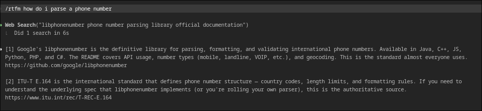
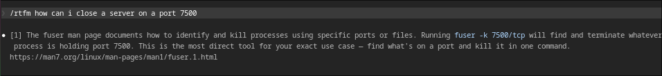

# rtfm

A Claude Code skill that finds authoritative reference sources for any question. Instead of summarizing answers, it points you at the manual — official docs, specs, RFCs, guides — with a short explanation of why each source is relevant.

Returns 1-3 sources. Prefers one perfect source over three okay ones.

## Install

```bash
mkdir -p ~/.claude/skills/rtfm && curl -fsSL https://raw.githubusercontent.com/huncho/rtfm/main/SKILL.md -o ~/.claude/skills/rtfm/SKILL.md
```

## Usage

```
/rtfm how do rust lifetimes work
/rtfm nginx reverse proxy config
/rtfm css container queries
```

## Example




